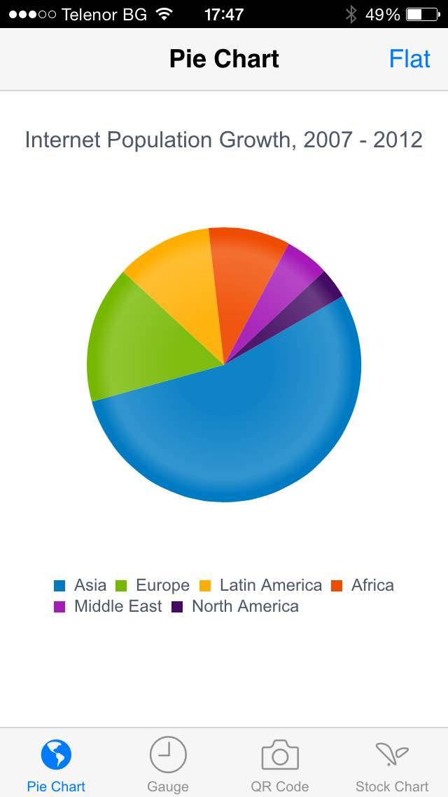
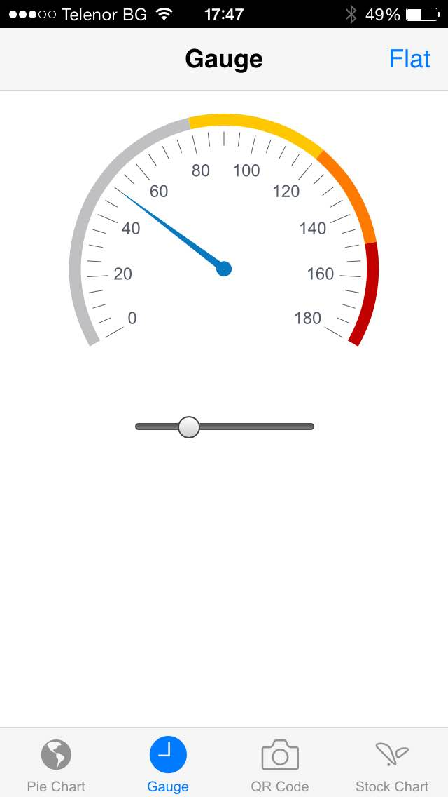
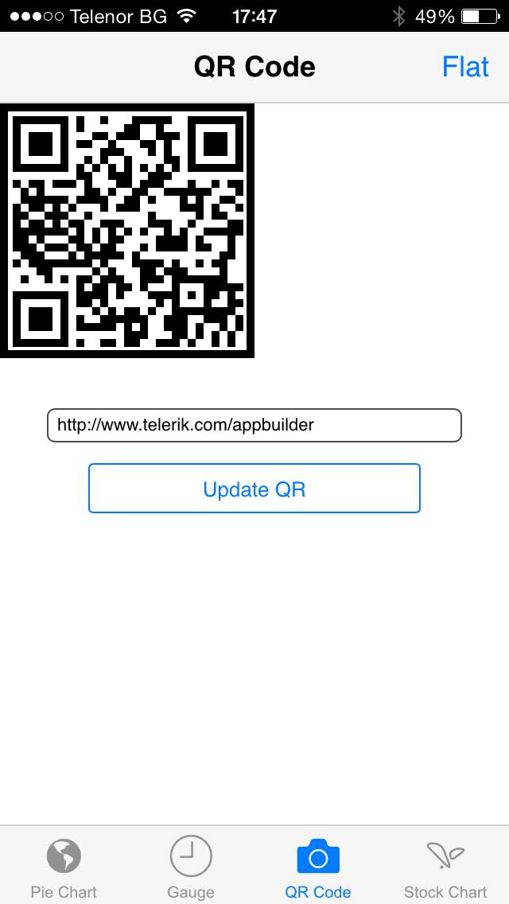
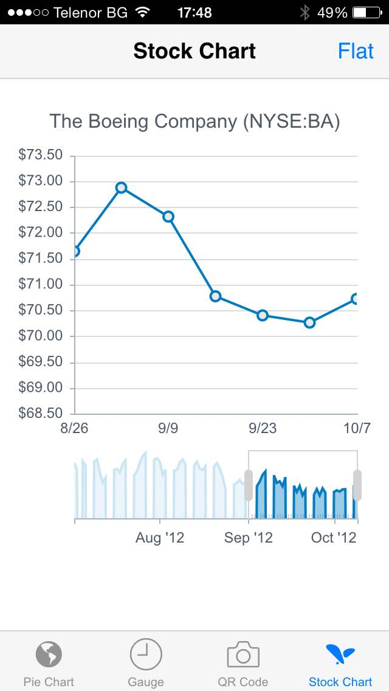
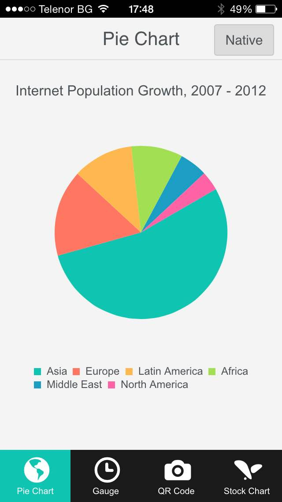
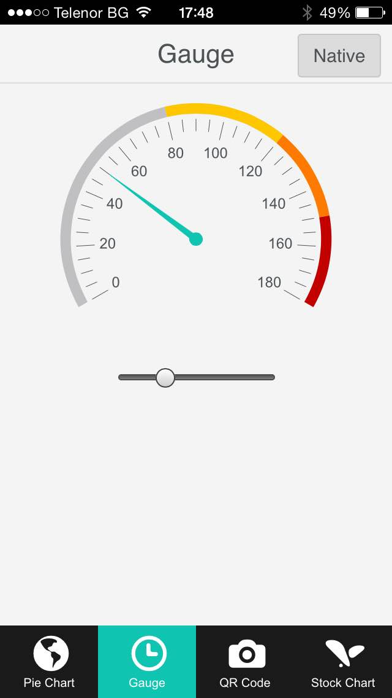
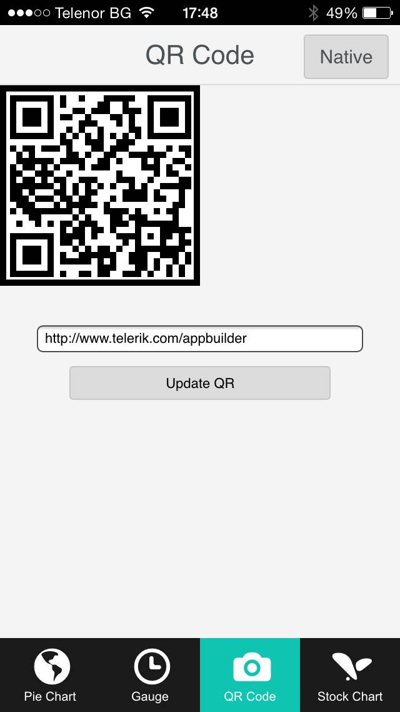
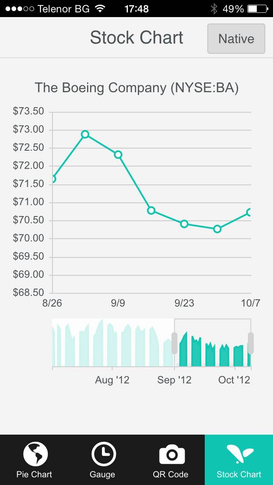

Kendo UI Professional Mobile App with Data Visualization
===
 

* [Overview](#overview)
* [Screenshots](#screenshots)
* [Limitations](#limitations)

## Overview

This demo app is a hybrid mobile app with rich HTML5-based data visualization, developed with Kendo UI Professional. It provides a pie chart, a stock chart, a gauge and a QR code generator.

> *Last updated:* May 29, 2015
> 
> *Supported mobile platforms:* iOS, Android, Windows Phone
>
> *Developed with:* Apache Cordova 3.7.0

### Showcased APIs

This sample shows you how to use the following widgets and features of Kendo UI Professional.

* **[Application][Application]**: The widget provides the necessary tools for building native-looking web based mobile applications.
* **[RadialGauge][RadialGauge]**: The widget lets you quickly determine where a value lies in a range. Kendo UI draws the gauge using SVG.
* **[Chart][Chart]**: The widget draws high quality charts of the following types: bar, column, line, area, bullet, pie, donut, scatter, bubble, radar, and polar. Kendo UI draws the chart using SVG.
* **[QRCode][QRCode]**: The widget generates canvas or SVG images that represent QR codes. Kendo UI draws the QR code using SVG.
* **[StockChart][StockChart]**: The widgets lets you visualize stock prices and related graphs. Kendo UI draws the QR code using SVG.
* **[DataSource][DataSource]:** The DataSource component is an abstraction for using local data (array of JavaScript objects) or remote data (web service returning JSON, JSONP, OData or XML). 

For more information about the Kendo UI Professional widget APIs, see the [Kendo UI API Reference][Kendo UI API Reference]. 

This sample shows you how to use the following Apache Cordova core plugin.

* **[Splashscreen][Splashscreen]:** The plugin shows or hides the splash screen when the app launches.

### Important Directories and Files

* `data\boeing-stock.json`: Contains dummy data for the stock chart.
* `scripts\app.js`: Contains the application initialization and the implementation of switching between the native and the flat UI skins.
* `scripts\gauge.js`: Contains the implementation of the gauge.
* `scripts\pie-chart.js`: Contains the implementation of the pie chart.
* `scripts\qr-code.js`: Contains the implementation of the QR code generator.
* `scripts\stock-chart.js`: Contains the implementation of the stock chart.

## Screenshots

Skin | Pie Chart | Radial Gauge | QR Code | Stock Chart
--- | --- | --- | --- | ---
Native |  |  |  | 
Flat |  |  |  | 

## Requirements

## Configuration

## Build/Run the Sample

## Limitations

* This demo app does not include Kendo UI Professional. You need to manually include it in your project.

## License

[Running the Sample]: #running-the-sample
[Telerik AppBuilder web page]: http://www.telerik.com/appbuilder
[License]: License.md
[Kendo UI web page]: http://www.telerik.com/kendo-ui
[Kendo UI API Reference]: http://docs.telerik.com/kendo-ui/api/introduction
[Running Your App]: http://docs.telerik.com/platform/appbuilder/testing-your-app/run-your-app
[Application]: http://docs.telerik.com/kendo-ui/mobile/application
[RadialGauge]: http://docs.telerik.com/kendo-ui/api/javascript/dataviz/ui/radialgauge
[Chart]: http://docs.telerik.com/kendo-ui/api/javascript/dataviz/ui/chart
[QRCode]: http://docs.telerik.com/kendo-ui/api/javascript/dataviz/ui/qrcode
[StockChart]: http://docs.telerik.com/kendo-ui/api/javascript/dataviz/ui/stock-chart
[DataSource]: http://docs.telerik.com/kendo-ui/framework/datasource/overview
[Splashscreen]: https://github.com/apache/cordova-plugin-splashscreen/blob/master/doc/index.md